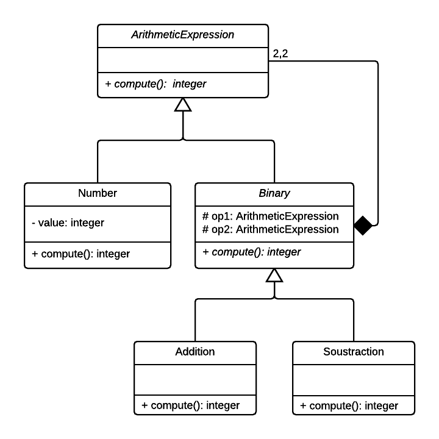

### Composite & Interpreter pattern

#### Structural - Behavioral

Interpreter:

Given a language, define a representation
for its grammar along with an interpreter
that uses the representation to interpret
sentences in the language.
Implement lose coupling in a request-response model application.

Composite:

Compose objects into tree structures to
represent part-whole hierarchies. Lets
clients treat individual objects and
compositions of objects uniformly.

Source code stems from the following UML diagram:

